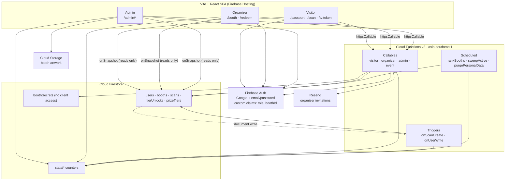
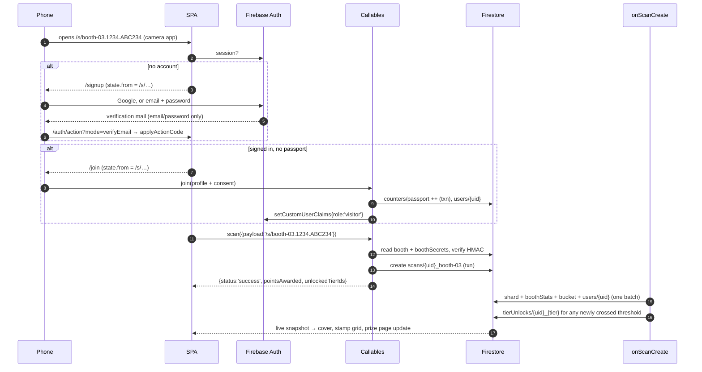
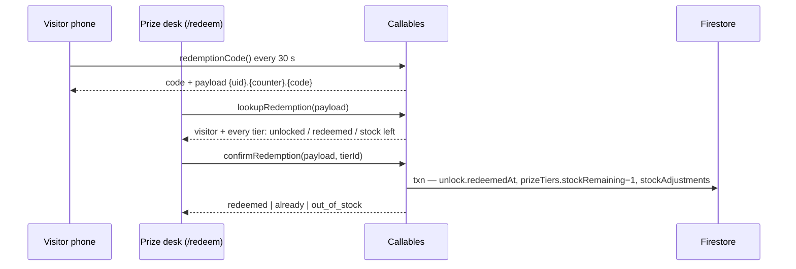
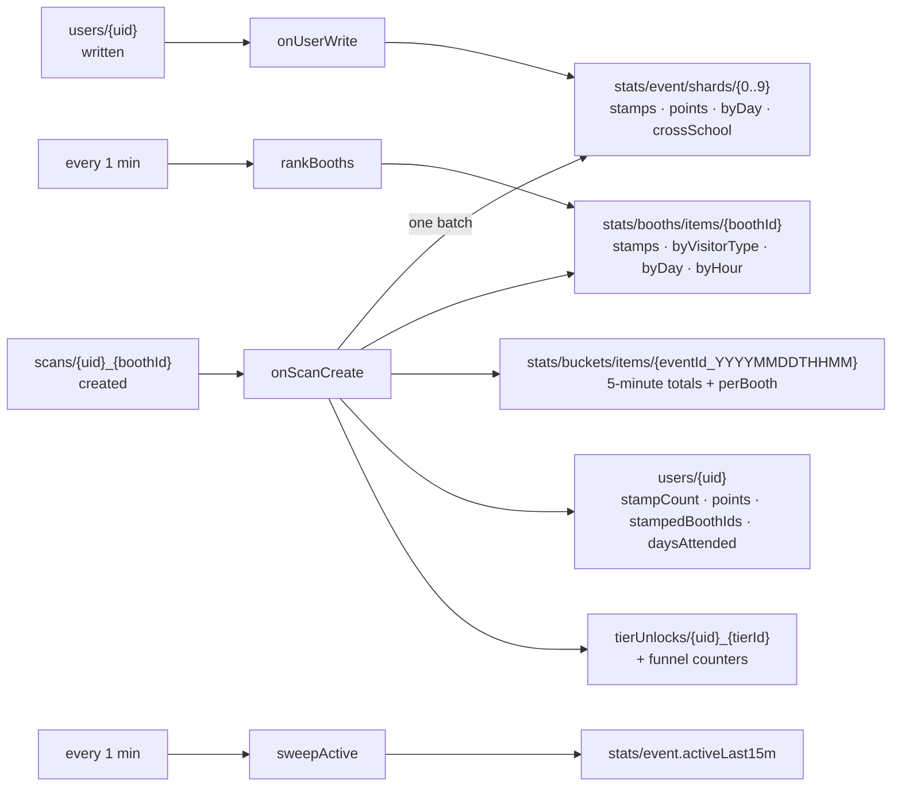

# System flow

How the MFU InterFest Passport actually works end to end: the pieces, who may call what, and
the order things happen in. Companion to `spec/spec.md` (the *what* and *why*), `SETUP.md`
(how to stand it up) and `docs/UAT.md` (how to test it by hand).

Section references like §4.3 point at `spec/spec.md`.

---

## 1. The shape of the system



Three ideas carry the whole design:

1. **Every consequential write goes through a callable.** `firestore.rules` is `allow write: if false`
   on every collection; the client only ever reads. Validation, rate limits, transactions and the
   audit log all live in one place.
2. **Claims are the authority.** `role` (and `boothId` for organizers) are Firebase Auth custom
   claims, mirrored onto `users/{uid}` for display only. Rules and callables read the claim.
3. **The event is a document, not a build constant.** `events/{id}` with `status: 'live'` carries the
   name, dates, days, QR period, passport prefix and per-zone points — so the app is reusable
   without a redeploy.

**Stack:** React 19 + React Router 7 + Tailwind 4, `firebase` web SDK v11 with persistent local
cache; `firebase-admin` + `firebase-functions` v6 on Node 20, everything pinned to
`asia-southeast1`, `maxInstances: 20`, `timeoutSeconds: 30`.

`shared/` (`model.ts`, `token.ts`) is imported by both sides. `scripts/copy-shared.mjs` runs as the
functions `prebuild` step and copies it into `functions/src/shared/`, because `firebase deploy`
uploads only the `functions/` folder. **Never import Node-only `crypto` in `shared/`** — the token
code runs in the browser too, so it uses Web Crypto.

---

## 2. Roles and route guards

| Role | Claim | Screens |
|---|---|---|
| Visitor | `{ role: 'visitor' }` | `/passport`, `/passport/stamps`, `/passport/prize`, `/scan` |
| Organizer | `{ role: 'organizer', boothId }` | `/booth`, `/booth/stats`, `/redeem` (prize desks only) |
| Admin | `{ role: 'admin' }` | all of `/admin/*`, plus every organizer and visitor screen |

[App.tsx](../src/App.tsx) has two gates:

- **`RequireUser`** — signed in *and* email confirmed. Used for `/join`.
- **`Guard roles={[…]}`** — the above plus a matching claim.

Both stash the current path in `location.state.from`, so an interrupted visitor comes back to the
booth they were scanning rather than the home page. A signed-in caller with **no** role hitting a
visitor route is sent to `/join`, not to `/`.

[auth.tsx](../src/lib/auth.tsx) holds the session: it collects `getRedirectResult` before the first
`onAuthStateChanged` (Google popup falls back to redirect), refreshes claims on window focus and
every 15 minutes, keeps a live listener on `users/{uid}`, and repairs `contact` via the
`syncAccount` callable whenever the Auth email and the Firestore copy disagree.

Public routes: `/`, `/signin`, `/signup`, `/forgot-password`, `/verify-email`, `/auth/action`,
`/invite/:token`, `/s/:token`, `/r/:token`, `/setup`.

---

## 3. Data model

| Path | Written by | Read by (rules) |
|---|---|---|
| `events/{id}` | `createEvent`/`updateEvent`/`goLive`/`archiveEvent` | **public** (landing page needs the name before sign-in) |
| `users/{uid}` | `join`, `createUser`, `updateUser`, `acceptInvite`, `onScanCreate` | owner + admin |
| `booths/{id}` | `createBooth`/`updateBooth`/`deleteBooth`, seed | any signed-in |
| `boothSecrets/{id}` | `createBooth`, `rotateBoothSecret`, seed | **nobody** — only the `boothSession` callable hands one out |
| `scans/{visitorId}_{boothId}` | `scan` (transactional `create`) | owner + admin |
| `prizeTiers/{id}` | `savePrizePolicy`, `adjustStock` | any signed-in |
| `tierUnlocks/{visitorId}_{tierId}` | `onScanCreate`, `savePrizePolicy`, `confirmRedemption`, `voidRedemption` | owner + organizer + admin |
| `stockAdjustments/{id}` | `adjustStock`, redeem, void | admin |
| `invites/{id}` | `inviteOrganizer`, `resendInvite`, `revokeInvite`, `acceptInvite` | admin |
| `refData/{institutions,mfuSchools,ethnicGroups}` | `saveRefData`, seed | **public** (the registration form reads it pre-auth) |
| `stats/event` + `stats/event/shards/{0..9}` | `onScanCreate`, `onUserWrite`, `sweepActive` | admin + organizer |
| `stats/booths/items/{boothId}` | `onScanCreate`, `rankBooths` | admin + organizer |
| `stats/buckets/items/{id}` | `onScanCreate` | admin |
| `draws/{id}` | `runDraw` | admin |
| `auditLog/{id}` | `audit()` from every mutating callable | admin |
| `erasureRequests/{uid}` | `requestErasure`, `deleteUser`, `dismissErasureRequest` | owner + admin |
| `archives/{eventId}` | `archiveEvent` | admin |
| `counters/passport`, `rateLimits/{key}` | callables | **nobody** |

Two ids are deterministic and that is load-bearing:
`scans/{visitorId}_{boothId}` makes "one stamp per booth" a primary-key constraint rather than a
query, and `tierUnlocks/{visitorId}_{tierId}` does the same for prize unlocks. Both are why an
event must be **purged** before booth ids are reused (see §8).

`ScanDoc` deliberately copies the visitor's type, institution, school and country at scan time —
and deliberately **does not** copy `ethnicGroup` (PDPA s.26, §7.1). `pointsAwarded` is frozen at
scan time so re-pricing a booth mid-event never rewrites history.

---

## 4. Visitor flow



### 4.1 Registration (`join`)

Anonymous sign-in is off. The caller already holds a Google or email/password account, so `join`
refuses unless `email_verified === true` and takes the contact from the token rather than the form.
It then: validates the profile, rate-limits to **5 registrations per hour per /24 IP prefix**,
returns early if the uid already has a passport, refuses if another document already holds the
address (one address = one passport), allocates a sequence number from `counters/passport` in a
transaction, formats it with the *live event's* prefix (`MFU-GG-0001`), writes `users/{uid}` and
sets the visitor claim.

`ethnicGroup` is stored only when its **own separate** consent tick is present and the answer is not
"Prefer not to say" (§4.1, §10).

### 4.2 The rotating booth QR (§5.2)

Computed identically on the booth screen and in the `scan` callable, from [shared/token.ts](../shared/token.ts):

```
period  = event.qrPeriodSeconds        (default 20 s, 10–120 allowed)
counter = floor(unix_seconds / period)
digest  = HMAC-SHA256(boothSecret, "<boothId>:<counter>")
token   = base32(digest)[0..5]         6 chars — also the spoken manual code
payload = https://<origin>/s/<boothId>.<counter>.<token>
```

- The **secret never reaches a browser except through `boothSession`**, which requires an organizer
  (own booth) or admin (any booth) claim. `boothSecrets` is denied to every client in the rules.
- The booth screen ([Booth.tsx](../src/pages/organizer/Booth.tsx)) fetches the secret once plus a
  `serverTime` skew, then rotates locally on a timer — **it keeps producing valid codes offline**.
  It also holds a screen wake lock and renders a countdown that traces the frame border.
- `scan` accepts the **current or previous** counter (one period of grace). A well-formed token from
  an older window returns `expired` (rescan) rather than `invalid` (wrong code) — the distinction is
  made by verifying the HMAC for the counter the token claims.
- Because the counter depends on the event's period, a warm instance holding a stale cached event
  would reject good codes right after a new event goes live. `scan` therefore force-refreshes the
  event once on the failure path before giving up.
- **Manual entry:** a bare 6-character code is matched against every active booth for the current
  and previous counter (12 booths × 2 = 24 HMACs).
- **Rate limit:** 10 scans per minute per uid, fixed window on `rateLimits/scan_{uid}`.
- `rotateBoothSecret` is the emergency lever: every photographed code dies immediately.

Scan outcomes are `success | already | expired | invalid | rate_limited | not_registered`.
`success` returns optimistic totals so the visitor sees "+15 points" instantly; the authoritative
totals land a moment later via the trigger and the live snapshot.

### 4.3 Points and prize tiers (§6.6)

Booth points are priced by zone — entrance 10, middle 15, far corner 20 — which is what makes a
visitor walk past the entrance row. Tiers are thresholds on the **sum of points**: Explorer 50,
Voyager 100, Globetrotter 150 against 170 available in the seeded hall. `savePrizePolicy` refuses
any threshold above the points actually available, offers a `dryRun` preview of how many visitors
would newly qualify, and back-fills unlocks when a threshold is *lowered* (raising one never
revokes). Tiers dropped from the list are deactivated, never deleted, so unlock history survives.

### 4.4 Prize redemption (§4.4, §6.7)

The visitor's own code rotates too — 8 characters on a **30-second** period, HMAC'd over `r:{uid}`
and `r2:{uid}` with a server-side secret at `boothSecrets/_redemption`, created on first use.
`/passport/prize` re-fetches it just before each expiry, so a screenshot is useless.



`confirmRedemption` needs an organizer whose booth is flagged `isPrizeDesk` (admins bypass), and
does the whole thing in one transaction so two desks cannot double-issue. `voidRedemption` is
**admin only**: it returns the item to stock, reopens the tier (the visitor still qualifies) and
writes both a `stockAdjustments` row and an audit entry.

`/r/:token` handles the desk scanning the visitor's QR with the native camera app: an organizer or
admin is bounced to `/redeem?code=…`, a visitor is told to show the code instead.

---

## 5. Organizer flow

```
admin /admin/users → inviteOrganizer(name, email, boothId, role)
   ↳ invites/{id}: tokenHash = sha256(token), status 'sent',
     expiresAt = min(now + 14 days, event end)
   ↳ Resend (server-side, API key) → link  <origin>/invite/<token>
     · mail not configured → the link is returned to the admin to copy by hand
/invite/:token → inviteInfo(token)     marks 'opened', names the invited address
              → sign in as that address (Google or password)
              → acceptInvite(token)    claims + users/{uid} + booths/{id}.organizerUid
                                       status 'accepted' (single use)
              → /booth  (or /admin for an admin invitation)
```

`acceptInvite` is bound to the invited address *and* requires `email_verified` — a different signed-in
account is refused with a clear message, which is why the page names the address up front. Revoked
invitations keep their hash so a second visit says "withdrawn" rather than "invalid".

The booth screen itself is meant to be left alone all day: `boothSession` once, then local rotation,
a wake lock, an online/offline dot ("Offline — codes still valid"), live "visitors here / event
total / rank of N" from `stats/*`, and a print-only static table card since a rotating QR cannot be
printed.

---

## 6. Admin flow

`AdminLayout` groups the panel by when you need it:

- **Run** — Dashboard, Hall screen (`/admin/wall`), Prize desk, Stage draw
- **Set up** — Event, Booths, Prizes & stock, Users & invites
- **Records** — Audit log, Reference lists

Outside the layout (so no chrome reaches the paper or the projector): `/admin/print`,
`/admin/booth-cards`, `/admin/wall`.

**First admin.** `bootstrapAdmin` elevates the *first* signed-in caller who presents the
`ADMIN_BOOTSTRAP_KEY` secret, and refuses once any admin exists — `/setup` is that one-time form.
`functions/src/rescueAdmin.ts` (`npm run rescue:admin`) attaches an email credential to an account
that already holds the claim, for the case where the only admin cannot sign in.

**Everything else** goes through admin callables, each of which writes an `auditLog` entry:
`setUserRole`, `createUser` (walk-up desk account, optional password, own passport number),
`updateUser` (moves the email on the Auth account too), `deleteUser` (soft = anonymise + disable;
`hard` = account, scans and unlocks gone), `createBooth`/`updateBooth`/`deleteBooth`
(deactivates instead of deleting once the booth has scans), `rotateBoothSecret`, `savePrizePolicy`,
`adjustStock` (always with a reason and a `stockAdjustments` row), `runDraw`, `saveRefData`,
the invitation set, and `refreshRanks`.

`Readiness.tsx` on the dashboard replaces a setup document nobody reads at the desk: active booths,
a saved prize policy, organizers linked to booths, mail configured (via `setupStatus`, the one thing
the client cannot see), and a sign-in method on the admin's own account.

---

## 7. Statistics pipeline

Counters are pre-aggregated on write; the dashboard never scans `scans`.



- **10 shards** (`STATS_SHARDS`) spread the write contention; `useEventStats()` sums them client-side.
- `onUserWrite` fires only on a *transition* into or out of "live visitor" (`role === 'visitor'` and
  no `deletedAt`), so ordinary profile edits cost nothing, and it maintains the visitor-type,
  country, institution, school and ethnic-group breakdowns.
- `rankBooths` runs every minute — Cloud Scheduler's floor — and `refreshRanks` is the manual nudge.
- `sweepActive` counts scans in the last 15 minutes with an aggregation `count()` query.
- `useDashboardModel(day)` derives every dashboard number, CSV export and print view from the same
  ~120 live documents, so the screen and the exports can never disagree.
- Every live hook reports listener failures into a shared registry that `<DataErrors/>` renders — a
  denied read or a missing index says which data is missing instead of silently showing zero.

---

## 8. Event lifecycle

```mermaid
stateDiagram-v2
  [*] --> draft: createEvent
  draft --> draft: updateEvent
  draft --> [*]: deleteEvent (drafts only)
  draft --> live: goLive — needs ≥1 active booth + a prize policy;<br/>any other live event is archived in the same batch
  live --> archived: archiveEvent — freeze totals to archives/{id}<br/>(type the event name to confirm)
  archived --> archived: purgeEventData(scope) — paged, archived events only
```



`getActiveEvent()` in [functions/src/lib.ts](../functions/src/lib.ts) resolves the one `status: 'live'`
document and memoises it for **30 seconds per instance** — the hot `scan` path needs it on every
call. Anything writing the event's identity into a durable record (a passport prefix, a booth's
`eventId`, an invitation's expiry) passes `force` and bypasses the cache; `clearEventCache()` reaches
only the instance that made the change, which is why the forced re-reads matter.

**Archive, then purge.** `archiveEvent` freezes totals, per-booth stamps, per-tier stock and
redemptions, and the draw history into `archives/{id}` — once the scans and stats are gone the
numbers cannot be reconstructed, so `purgeEventData` refuses any event that is not already
`archived`.

`purgeEventData` deletes **one page at a time** (≤300 docs, 120 s timeout) and the admin page loops
on it showing progress, because a three-day event is ~1,500 visitors × 12 booths of scans. Scopes:

| Group | Scopes |
|---|---|
| Working data | `scans`, `tierUnlocks`, `stockAdjustments`, `draws`, `buckets`, `invites`, `rateLimits` |
| Counters | `boothStats` (zeroed), `eventStats`, `counters` |
| Visitors | `visitors` — resets progress by default, `hard: true` deletes accounts (PDPA) |
| Start blank | `booths` (+ secrets, booth stats, Storage artwork), `prizeTiers` |
| Carry over instead | `resetTierStock`, `rotateSecrets` |

Purging `scans` and `tierUnlocks` is exactly what makes booth ids safe to reuse — without it a
returning visitor could never re-stamp a `booth-01` that belongs to a different event. Carrying
booths over **must** be paired with `rotateSecrets`, or last year's photographed QR would still work.

---

## 9. Privacy and retention (§10, PDPA)

- **Ethnic group** is optional, gated behind its own consent, never copied onto `ScanDoc`, never
  shown in a per-person view, and suppressed in aggregate below 5 people.
- **Self-service erasure:** `requestErasure` is idempotent (asking twice reports the first request)
  and copies the name, passport number and address into the request so the admin inbox still
  identifies the person after a soft delete has anonymised them. An admin closes it with
  `deleteUser` (soft or hard) or `dismissErasureRequest` with a reason.
- **Retention:** `purgePersonalData` runs daily at 03:00 Asia/Bangkok and is a no-op until **90 days
  after the live event's `endsAt`** — never a fixed date, or a future event's visitors would be
  purged mid-run. It anonymises up to 400 visitor documents per run.
- **Refusals with meaning:** rules deny `boothSecrets`, `rateLimits` and `counters` to every client;
  `refData/*` and `events/*` are public *by design* (the registration form and landing page read
  them before sign-in) and hold nothing sensitive — the institution and school lists are
  suggestions, never a security boundary, and the form accepts free text.

---

## 10. Mail

| Message | Sent by | Configured in |
|---|---|---|
| Address verification, password reset, address change | **Firebase Auth itself**, triggered from [authActions.ts](../src/lib/authActions.ts) | Console → Authentication → Templates |
| Organizer / admin invitation | `inviteOrganizer` / `resendInvite` via Resend, server-side | `RESEND_FROM` / `RESEND_REPLY_TO` params + `RESEND_API_KEY` secret |

All three Auth mails point their action URL at `<origin>/auth/action`, which
[Action.tsx](../src/pages/auth/Action.tsx) handles for all of `verifyEmail`, `resetPassword`,
`recoverEmail` and `verifyAndChangeEmail`, so the visitor stays inside the passport. Leave the
action URL unset and Firebase's own page still works — it just looks like someone else's site.

Mail never goes out from the browser. If Resend is not configured, the invitation callable returns
the link so the admin can copy it by hand, and `setupStatus` tells the readiness checklist.

---

## 11. Build, run, deploy

```bash
npm install && npm --prefix functions install
npm run emulators   # Auth 9099 · Firestore 8080 · Functions 5001 · Hosting 5000 · Storage 9199 · UI 4000
npm run dev         # Vite 5173, auto-connects to the emulators
npm run seed:emulator   # event + 12 booths (with secrets) + 3 tiers + reference data — idempotent
npm run e2e         # reset, reseed, then a 145-check run through the real rules and triggers
npm run typecheck
npm run deploy      # tsc -b && vite build, functions build, firebase deploy
```

The client picks up the emulators when `VITE_USE_EMULATOR=true`, or in dev with no
`VITE_FIREBASE_API_KEY` (see `.env.local.example`). Hosting serves `dist/` with a
single-page rewrite and immutable caching on hashed assets.

`npm run e2e` drives four ordered steps sharing one context —
[10-admin-setup](../scripts/e2e/10-admin-setup.mjs), [20-visitor](../scripts/e2e/20-visitor.mjs),
[30-organizer](../scripts/e2e/30-organizer.mjs), [40-lifecycle](../scripts/e2e/40-lifecycle.mjs) — through
the **client** SDK wherever a client would, so the real security rules are exercised. It uses the
emulator owner APIs only for what no client can do: flip `emailVerified`, read a booth secret,
elevate a second admin. It covers the two-desk redemption race and the archive → purge → next-event
booth-id reuse.

---

## 12. Where things live

| Path | What |
|---|---|
| [shared/model.ts](../shared/model.ts) | Document shapes, zone points, `dayOf`/`hourOf`, `passportNo`, `ScanResult` |
| [shared/token.ts](../shared/token.ts) | The HMAC token: compute, parse, normalise, constant-time compare |
| [functions/src/lib.ts](../functions/src/lib.ts) | Admin SDK singletons, `requireRole`, validators, `getActiveEvent`, `rateLimit`, `audit`, stats refs |
| [functions/src/visitor.ts](../functions/src/visitor.ts) | `join`, `scan`, `redemptionCode`, `syncAccount`, `requestErasure` |
| [functions/src/organizer.ts](../functions/src/organizer.ts) | `boothSession`, `lookupRedemption`, `confirmRedemption`, `voidRedemption` |
| [functions/src/admin.ts](../functions/src/admin.ts) | Users, booths, prizes, draw, reference data, invitations, `bootstrapAdmin` |
| [functions/src/event.ts](../functions/src/event.ts) | `createEvent` → `goLive` → `archiveEvent` → `purgeEventData`, `listEvents` |
| [functions/src/triggers.ts](../functions/src/triggers.ts) | `onScanCreate`, `onUserWrite`, `rankBooths`, `sweepActive`, `purgePersonalData` |
| [functions/src/mailer.ts](../functions/src/mailer.ts) | Resend invitation send, and the invitation's own HTML |
| [functions/src/seed.ts](../functions/src/seed.ts) · [rescueAdmin.ts](../functions/src/rescueAdmin.ts) | Idempotent seed; admin sign-in rescue |
| [src/lib/api.ts](../src/lib/api.ts) | Every callable, typed, in one object |
| [src/lib/data.ts](../src/lib/data.ts) | Live-snapshot hooks + the shared listener-error registry |
| [src/lib/auth.tsx](../src/lib/auth.tsx) · [authActions.ts](../src/lib/authActions.ts) | Session and claims; all Firebase Auth operations |
| [firestore.rules](../firestore.rules) · [storage.rules](../storage.rules) | Read-only clients; booth artwork ≤2 MB, images, admin-write |
| [firestore.indexes.json](../firestore.indexes.json) | Composite indexes for scans, users, tierUnlocks |
| [docs/UAT.md](UAT.md) | The manual acceptance checklist |
